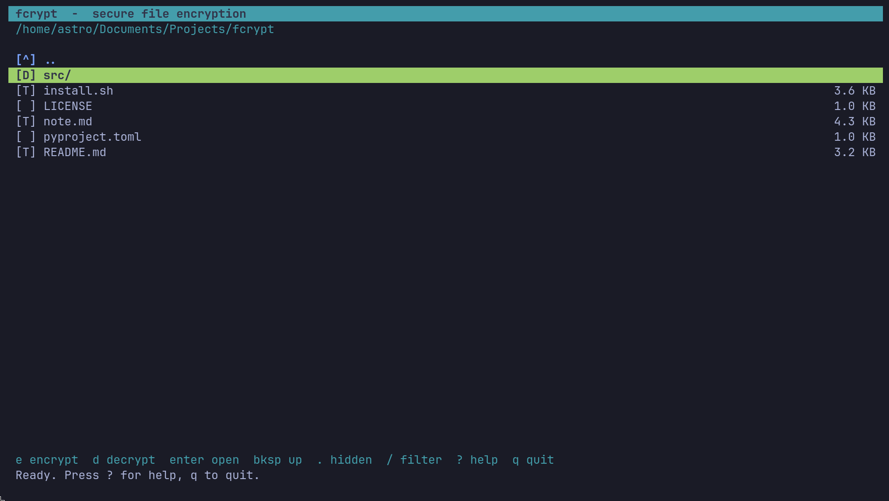

# Fcrypt

**Simple, secure file encryption from your terminal.**

`fcrypt` is a lightweight command-line and terminal UI application for encrypting and decrypting files using modern cryptography.

Whether it's a text file, image, PDF, archive, or document, `fcrypt` allows you to protect it with a password and restore it later with a single command.

Built for Linux with a minimal dependency footprint and a keyboard-driven interface.

---

## Features

- AES-256 authenticated encryption (AES-GCM)
    
- Password-based encryption with scrypt key derivation
    
- Encrypt any file type
    
- Fast command-line workflow
    
- Built-in terminal file browser (TUI)
    
- No cloud services, accounts, or telemetry
    
- Isolated installation using pipx or virtual environments
    
- Open source
    

---

## Screenshots



```text
fcrypt enc document.pdf
Password:
Confirm:
encrypted -> document.pdf.fcr
```

```text
fcrypt dec document.pdf.fcr
Password:
decrypted -> document.pdf
```

---

## Installation

### Recommended (pipx)

```bash
pipx install .
```

### Using the included installer

```bash
git clone <repository-url>
cd fcrypt-app
chmod +x install.sh
./install.sh
```

---

## Usage

### Open the Terminal UI

```bash
fcrypt
```

### Encrypt a File

```bash
fcrypt enc file.txt
```

### Decrypt a File

```bash
fcrypt dec file.txt.fcr
```

### Custom Output File

```bash
fcrypt enc photo.png -o secret.fcr
```

---

## Terminal UI Controls

|Key|Action|
|---|---|
|↑ ↓ / j k|Navigate|
|Enter|Open directory|
|Backspace|Go back|
|e|Encrypt selected file|
|d|Decrypt selected file|
|/|Filter files|
|.|Show/hide hidden files|
|r|Refresh|
|?|Help|
|q|Quit|

---

## Security

`fcrypt` uses a modern encryption design:

- **AES-256-GCM** for confidentiality and authentication
    
- **scrypt** for password-based key derivation
    
- Random salt generated for every encrypted file
    
- Random nonce generated for every encryption operation
    
- Authentication prevents silent corruption and tampering
    

Encrypted file format:

```text
FCRYPT01 | salt | nonce | ciphertext
```

If the password is incorrect or the encrypted data has been modified, decryption fails safely.

---

## Why I Built This

Many encryption tools are either:

- Too complex for casual use
    
- Focused only on archives
    
- Require graphical interfaces
    
- Depend on external services
    

`fcrypt` was built to provide a simple workflow:

```bash
fcrypt enc file.ext
fcrypt dec file.ext.fcr
```

No accounts. No cloud storage. No unnecessary configuration.

Just secure file encryption from the terminal.

---

## Project Structure

```text
src/fcrypt/
├── cli.py
├── core.py
├── tui.py
├── __main__.py
└── __init__.py
```

- `core.py` — encryption engine
    
- `cli.py` — command-line interface
    
- `tui.py` — terminal file browser
    
- `__main__.py` — Python module entry point
    

---

## Roadmap

- Windows support
    
- macOS support
    
- Batch encryption
    
- Directory encryption
    
- File shredding option
    
- Theme customization
    
- Package distribution on PyPI
    

---

## License

Licensed under the MIT License.

---

If you find this project useful, consider starring the repository.
